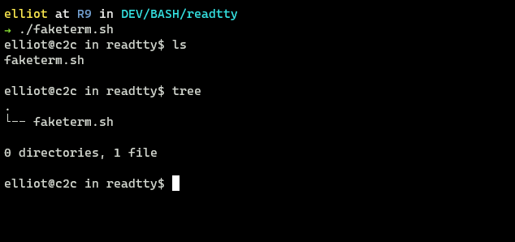
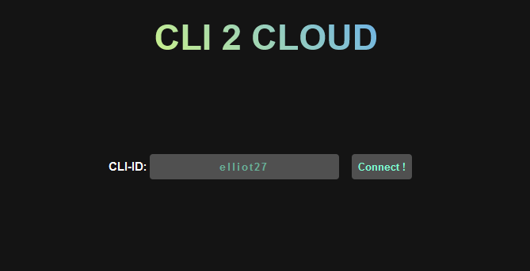
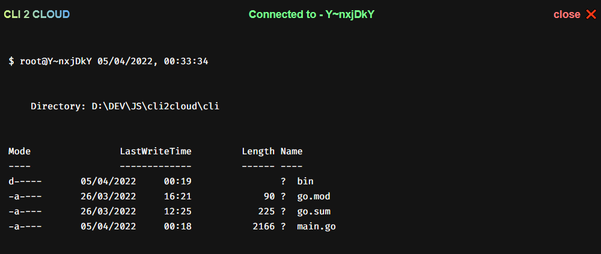
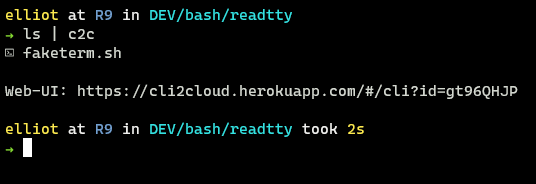
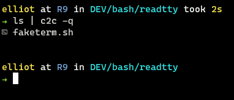

# CLI2CLOUD - pipe stdout to web


```sh
      _ _ ____      _                 _
  ___| (_)___ \ ___| | ___  _   _  __| |
 / __| | | __) / __| |/ _ \| | | |/ _` |
| (__| | |/ __/ (__| | (_) | |_| | (_| |
 \___|_|_|_____\___|_|\___/ \__,_|\__,_|

cli2cloud - A command line utility to pipe stdout to a web interface
Version: 0.1.0
```

- [Table of Contents](#fr---find-and-replace)
  - [Installation](#installation)
  - [Usage](#usage)
  - [Examples](#examples)

## Web interface

[https://cli2cloud.herokuapp.com/](https://cli2cloud.herokuapp.com/)

## Installation

### Clone the repo

```sh
git clone https://github.com/elliot40404/cli2cloud
cd cli2cloud/cli
go install
# The binaries are also available in the bin directory
```

or

### Direcly download the binary for linux with curl or wget

```sh
  wget https://github.com/elliot40404/cli2cloud/releases/latest/download/c2c
```

```sh
  curl -L -o c2c https://github.com/elliot40404/cli2cloud/releases/latest/download/c2c
```

```sh
  chmod +x c2c
```

```sh
  sudo ln -s $(pwd)/c2c /usr/local/bin/c2c
```

### Direcly download the binary for windows

[Windows-Binary](https://github.com/elliot40404/cli2cloud/releases/latest/download/c2c.exe)

### Checkout all releases

[Releases](https://github.com/elliot40404/cli2cloud/releases)

## Usage

#### 1. Download/Build the binary and add it to your PATH

#### 2. When using for the first time run `c2c`

This should generate a 8 character long key.

```sh
$ c2c
No key found
Creating new key...
Created key: 4MQrxK9p
```

#### 3. Now if you run c2c again it should show the key along with the instructions

```sh
$ c2c
Cli-2-Cloud
A command line interface for piping output to web
Key: 4MQrxK9p
Web-UI: https://cli2cloud.herokuapp.com/4MQrxK9p
Version: 0.1.0
Usage:
    $ command | c2c     - pipe stdout to web
    $ command | c2c -q  - pipe stdout to web quite mode
    $ c2c           - print this help menu
                      also generates a new key if none exists
```

#### 4. Now you can use the key to pipe the output to the web

Open up a browser and go to `https://cli2cloud.herokuapp.com/#/cli?id=<key>`

#### 5. Pipe the stdout to the web

```sh
echo "Hello World" | c2c
```

#### 5. Pipe the stdout and stderr to the web

```sh
echo "Hello World" |& c2c
```

#### 5. Pipe the stderr to the web

```sh
echo "Hello World" 2>&1 >/dev/null | c2c
```

## Advanced Usage

### Continous Mode

Put this snippet in a file. I am calling mine `term.sh`

```sh
#!/bin/bash
while true
do
  read -p "$USER@c2c in $(basename $PWD)\$ " p
  $p |& c2c -q
done
```

```sh
sudo chmod +x term.sh
sudo ./term.sh
```

This should run the command in a loop and give you a terminal like interface and piping to the web withouth the need to pipe.

> This is in no way an actual terminal interface. It is just a way/hack to pipe to the web without the need to pipe every command. This lacks basic terminal features like history and tab completion, ability backout of a dir. But it is a start.



I am working on an actual way to pipe stdout and stderr with the actual terminal interface.

## Screenshots




Default example



Passing the -q flag to c2c will not print the url



> NOTE: Your key is stored in the `~/c2c.dat` file.
> If you want to change the key you can delete the file and run `c2c` again.

## License

MIT
